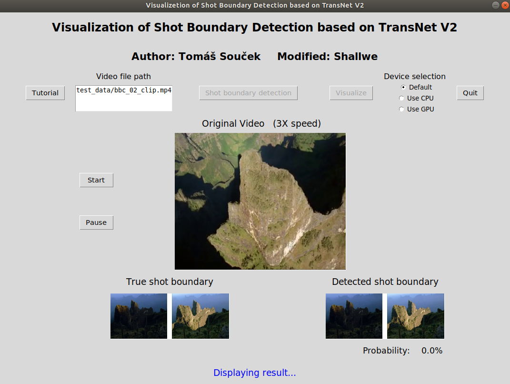

## TransNet V2 Visualization for Shot Boundary Detection

******



Introduction: A simple Python interface to show shot boundary detection based on TransNet V2.  
Repo size: 55 MB  
Hint: We just use the pretrained model here. If you want to train it, please see the TransNet V2 repo.  
Modifier: [Shallwe](https://github.com/shallwe999)  
Author: [Tomáš Souček](https://github.com/soCzech/TransNetV2)  
Paper: [TransNet V2: An effective deep network architecture for fast shot transition detection](https://arxiv.org/abs/2008.04838)  

******

### Environment

Recommended to run in Linux. Tested in `Ubuntu 18.04` .  

Necessary environments include `TensorFlow, ffmpeg, OpenCV, PIL, Tkinter` and so on, run these commands to install them.  

``` bash
pip install tensorflow==2.1
pip install opencv-python ffmpeg-python pillow
sudo apt install ffmpeg python-tk
```

### How to run

``` bash
# Run it in the project directory
python3 main.py
```

**Files Prepared**:  

- Original video. (MP4 format recommended)

- Label files of SBD. (Same directory as video. Named as \"VIDEO_NAME+.truth.txt\")

In directory `test_data/` , I provide a video `bbc_02_clip.mp4` as an example (Clipped from [BBC Planet Earth Test Dataset](https://aimagelab.ing.unimore.it/imagelab/researchActivity.asp?idActivity=19). You can download more test videos here.) to help you test this program.

**Process**:  

- Input location of video file. (Need to provide relative path from current work directory such as `test_data/bbc_02_clip.mp4` )

- Select "Device Select" (Recommend default)

- Click "Shot boundary detection"

- Wait for the evaluation of the model (until `SBD success` appears in cmd)

- Click "Visualize"

- You can click "Start" or "Pause" while video is playing

- Click "Quit"


**Files created**:  

- `VIDEO_PATH/video.mp4.scenes.txt` file containing a list of scenes - pairs of
  *start-frame-index*, *end-frame-index* (indexed from zero, both limits inclusive).
- `VIDEO_PATH/video.mp4.predictions.txt` file with each line containing raw predictions for corresponding frame
  (fist number is from the first 'single-frame-per-transition' head, the second from 'all-frames-per-transition' head)
- optionally it creates visualization in file `/path/to/video.mp4.vis.png`

### Credits

If found useful, please cite the author.

- GitHub Website: [soCzech/TransNetV2](https://github.com/soCzech/TransNetV2) 

- This paper: [TransNet V2: An effective deep network architecture for fast shot transition detection](https://arxiv.org/abs/2008.04838)

    ```
    @article{soucek2020transnetv2,
        title={TransNet V2: An effective deep network architecture for fast shot transition detection},
        author={Sou{\v{c}}ek, Tom{\'a}{\v{s}} and Loko{\v{c}}, Jakub},
        year={2020},
        journal={arXiv preprint arXiv:2008.04838},
    }
    ```

- ACM Multimedia paper of the older version: [A Framework for Effective Known-item Search in Video](https://dl.acm.org/doi/abs/10.1145/3343031.3351046)

- The older version paper: [TransNet: A deep network for fast detection of common shot transitions](https://arxiv.org/abs/1906.03363)

